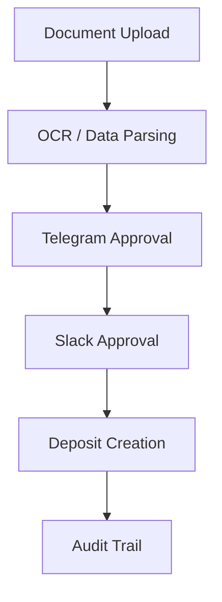
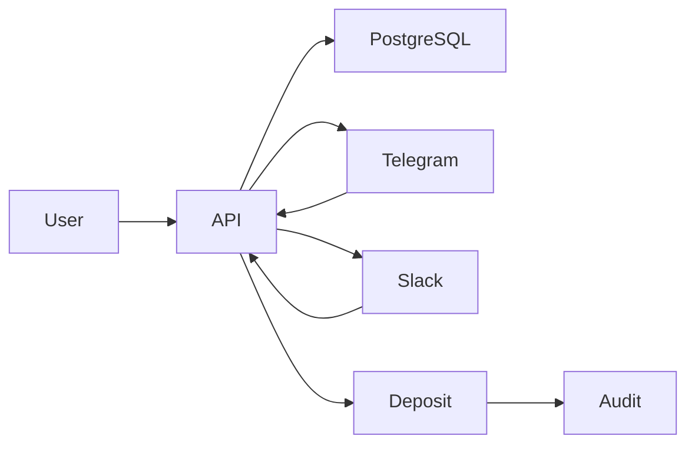

# Receipt Approval System


A **Dockerized backoffice payment workflow system** that automates the approval and processing of bank transfer receipts.

This project simulates how **financial operations teams validate payment receipts before creating deposit records** in trading or CRM systems.

---

# System Workflow



The workflow ensures that **every deposit is validated and approved before being processed**.

---

# Architecture



---

# Key Features

### Multi-Stage Approval System

The system implements a **two-layer approval mechanism**:

| Stage          | System        |
| -------------- | ------------- |
| First Approval | Telegram Bot  |
| Final Approval | Slack Webhook |

This architecture reduces operational risk in financial systems.

---

### Deposit Generation

After Slack approval:

* Deposit record is created
* TRY amount is converted to USD
* Deposit status becomes `DEPOSIT_PENDING`

Example:

```
amount_try = 1250.50
fx_rate = 0.032
amount_usd = 40.02
```

---

### FX Conversion Service

Supports configurable exchange rate modes.

Example configuration:

```
FX_MODE=manual
FX_MANUAL_RATE=0.032
```

---

### Audit Logging

Every workflow action is recorded in `audit_events`.

Example events:

| Event           | Description                 |
| --------------- | --------------------------- |
| TG_APPROVED     | Telegram approval completed |
| SLACK_APPROVED  | Slack approval completed    |
| DEPOSIT_CREATED | Deposit record created      |

This ensures **full traceability** of financial operations.

---

# API Example

Slack approval endpoint:

```
POST /slack/webhook
```

Example request:

```json
{
  "action": "approve",
  "public_key": "document_public_key",
  "actor": {
    "username": "slack_approver",
    "id": "U123456"
  }
}
```

Example response:

```json
{
  "ok": true,
  "status": "SLACK_APPROVED",
  "deposit_id": "uuid"
}
```

---

# Project Structure

```
api
 ├── routers
 │   ├── auth.py
 │   ├── telegram.py
 │   └── slack.py
 │
 ├── services
 │   ├── workflow.py
 │   ├── fx.py
 │   └── slack.py
 │
 ├── models
 │   ├── document.py
 │   └── deposit.py
 │
 ├── schemas
 │   └── slack.py
 │
 └── main.py

alembic/
docker-compose.yml
.env.example
```

---

# Running the Project

Clone the repository

```
git clone https://github.com/OzgurKaptann/receipt-approval-system.git
cd receipt-approval-system
```

Create environment file

```
cp .env.example .env
```

Start containers

```
docker compose up -d --build
```

Open API docs

```
http://localhost:8000/docs
```

---

# 🇹🇷 Türkçe Açıklama

Bu proje, banka havale veya EFT dekontlarının **çok aşamalı onay mekanizmasıyla işlenmesini sağlayan bir backoffice ödeme sistemi** simülasyonudur.

Gerçek finans operasyonlarında kullanılan süreçleri modellemek amacıyla geliştirilmiştir.

---

## Sistem Akışı

```
Dekont Yükleme
      ↓
OCR / Veri Ayrıştırma
      ↓
Telegram Onayı
      ↓
Slack Onayı
      ↓
Deposit Oluşturma
      ↓
Audit Log
```

Bu yapı sayesinde finans ekipleri **yanlış veya yetkisiz para yatırma işlemlerini önleyebilir.**

---

# Tech Stack

Backend

* FastAPI
* SQLAlchemy
* PostgreSQL
* Alembic

Infrastructure

* Docker
* Docker Compose

Integrations

* Telegram Bot API
* Slack Webhooks

---

# Future Improvements

Planned enhancements:

* Automatic FX rate integration
* CRM / MetaTrader integration
* Web dashboard for approvals
* Background processing jobs
* Reconciliation module


