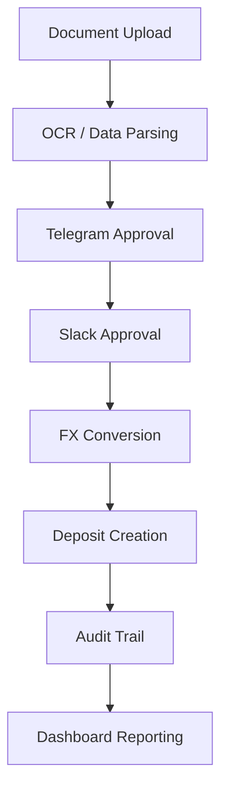
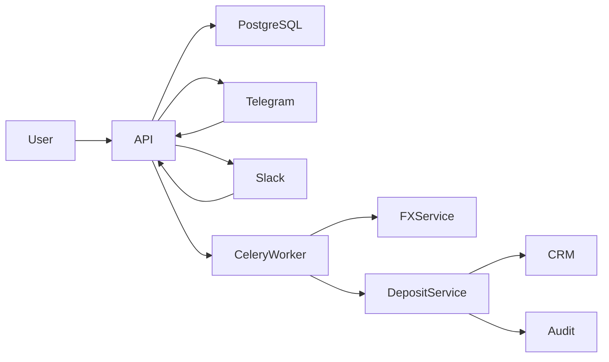
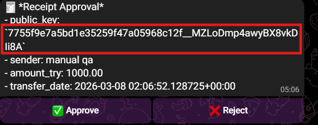
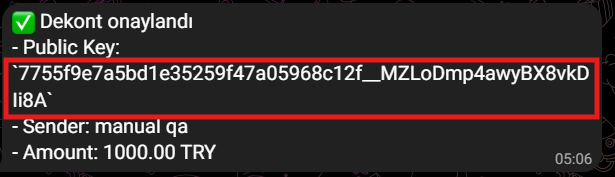
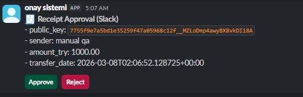
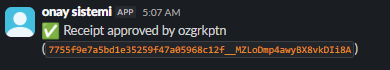
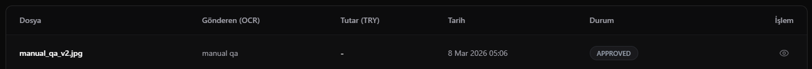
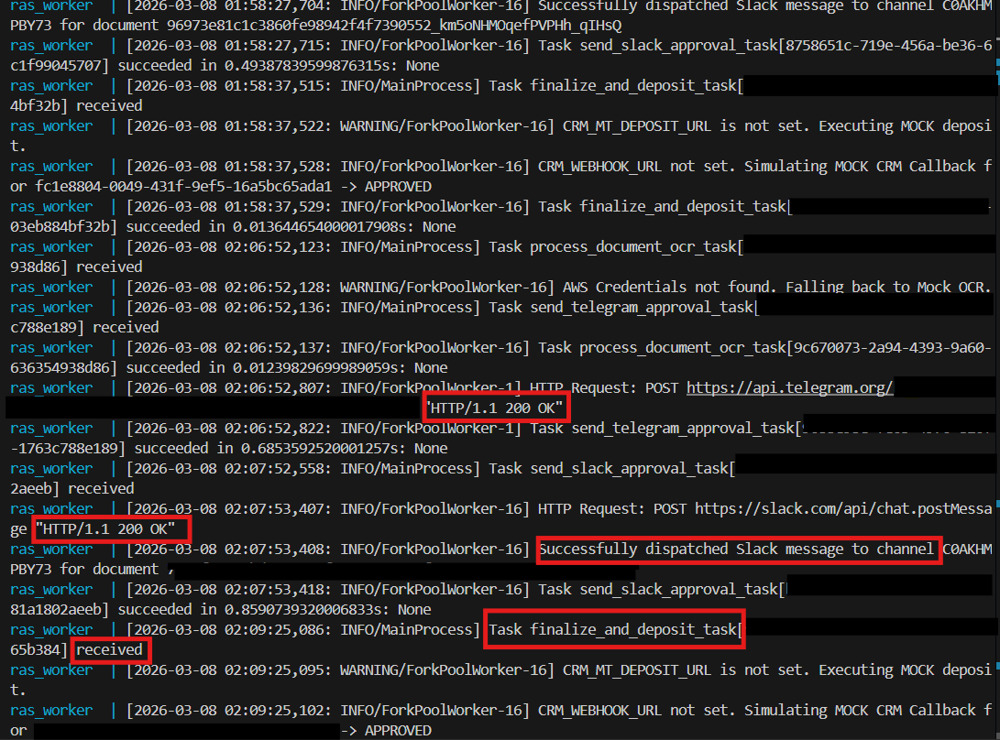

# Receipt Approval System


A **Dockerized backoffice payment approval system** that automates the validation and processing of bank transfer receipts.

This project simulates how **financial operations teams verify deposits before funds are credited to trading accounts or CRM systems**.

It demonstrates a practical **data engineering + backend workflow** involving:

- multi-step approval workflows
- webhook integrations
- background job orchestration
- FX rate conversion
- deposit creation
- audit logging
- SQL-based operational reporting

---

## Demo Workflow

The system processes a payment receipt through a multi-stage approval pipeline:

**Upload Receipt → OCR / Data Parsing → Telegram Approval → Slack Approval → FX Conversion → Deposit Creation → Audit Logging → Dashboard Reporting**

---

## System Workflow



The workflow ensures that **every deposit is validated and approved before being processed**.

---

## Architecture



### Core Architecture Components

| Component | Purpose |
|-----------|---------|
| FastAPI | REST API and webhook handlers |
| PostgreSQL | Operational database |
| Celery Worker | Background job processing |
| Telegram Bot | First approval layer |
| Slack Interactive API | Final approval layer |
| FX Service | Currency conversion |
| CRM Connector (Mock) | Deposit execution layer |
| Audit Events | Full operational traceability |

---

## Screenshots

### Telegram Approval



The first approval stage happens in Telegram where operations teams validate the transfer.

### Telegram Approved State



Once approved, the Telegram message is converted into a terminal state to prevent duplicate actions.

### Slack Approval



Slack acts as the second approval layer, typically used by supervisors or finance managers.

### Slack Approved State



After approval, the interactive Slack message becomes a final status message.

### Dashboard Record



The approved transaction appears in the dashboard after the deposit pipeline completes.

---

## Background Processing Evidence

The Celery worker orchestrates the asynchronous pipeline:

- Telegram approval dispatch
- Slack approval dispatch
- FX rate retrieval
- deposit generation
- CRM integration (mock)



This confirms the **full end-to-end workflow execution**.

---

## Key Features

### Multi-Stage Approval System

The system implements a two-layer approval architecture.

| Stage | Platform |
|------|----------|
| First Approval | Telegram Bot |
| Final Approval | Slack Interactive Webhook |

This reduces operational risk in financial systems.

### Automated Deposit Pipeline

After Slack approval the system automatically:

1. fetches FX rate
2. converts TRY → USD
3. creates deposit record
4. sends deposit instruction to CRM (mock)
5. stores audit events

Example:

```text
amount_try = 1250.50
fx_rate = 0.032
amount_usd = 40.02
```

### FX Conversion Service

The FX service supports configurable exchange-rate modes.

Example configuration:

```text
FX_MODE=manual
FX_MANUAL_RATE=0.032
```

In the final demo flow, the system also supports **live TCMB rate retrieval**.

### CRM / Trading Platform Integration

The final stage simulates sending deposit instructions to a CRM or trading system.

Possible integrations include:

- MetaTrader CRM
- internal trading ledgers
- payment reconciliation systems

In this demo, the connector runs in **mock mode**, but the architecture is designed for real downstream integrations.

### SQL-Based Operational Reporting

Because all transactions are stored in PostgreSQL, the system supports SQL analytics and operational reporting.

Example query:

```sql
SELECT
    date(created_at) AS deposit_date,
    COUNT(*) AS deposit_count,
    SUM(amount_try) AS total_try,
    SUM(amount_usd) AS total_usd
FROM deposits
GROUP BY deposit_date
ORDER BY deposit_date DESC;
```

This demonstrates how **operational workflows can feed analytics pipelines**.

---

## API Example

Slack approval endpoint:

```text
POST /slack/webhook
```

Example request:

```json
{
  "action": "approve",
  "public_key": "document_public_key",
  "actor": {
    "username": "slack_approver",
    "id": "U123456"
  }
}
```

Example response:

```json
{
  "ok": true,
  "status": "SLACK_APPROVED",
  "deposit_id": "uuid"
}
```

---

## Project Structure

```text
api
 ├── routers
 │   ├── auth.py
 │   ├── telegram.py
 │   └── slack.py
 │
 ├── services
 │   ├── workflow.py
 │   ├── fx.py
 │   └── slack.py
 │
 ├── models
 │   ├── document.py
 │   └── deposit.py
 │
 ├── schemas
 │   └── slack.py
 │
 └── main.py

alembic/
docker-compose.yml
.env.example
docs/
```

---

## Running the Project

Clone repository:

```text
git clone https://github.com/OzgurKaptann/receipt-approval-system.git
cd receipt-approval-system
```

Create environment file:

```text
cp .env.example .env
```

Start containers:

```text
docker compose up -d --build
```

Open API docs:

```text
http://localhost:8000/docs
```

---

# 🇹🇷 Türkçe Açıklama

Bu proje, banka havale veya EFT dekontlarının **çok aşamalı onay mekanizması ile işlenmesini simüle eden bir finans operasyon sistemidir**.

Gerçek finans operasyonlarında kullanılan aşağıdaki süreci modellemektedir:

**Dekont Yükleme → OCR / Veri Ayrıştırma → Telegram Onayı → Slack Onayı → Kur Hesaplama → Deposit Oluşturma → Audit Log → Dashboard**

Bu proje özellikle şu konuları göstermektedir:

- webhook tabanlı entegrasyonlar
- event-driven workflow tasarımı
- background job processing
- finansal işlem doğrulama
- audit trail / veri izlenebilirliği
- SQL ile operasyon raporlama

---

## Türkçe Özet

Sistem şu şekilde çalışır:

1. Kullanıcı dekontu yükler.
2. Sistem OCR ile verileri ayrıştırır.
3. İlk onay Telegram üzerinden alınır.
4. İkinci onay Slack üzerinden alınır.
5. Kur bilgisi alınır ve TRY → USD dönüşümü yapılır.
6. Deposit kaydı oluşturulur.
7. Audit event kayıtları yazılır.
8. Sonuç dashboard üzerinde görüntülenir.

Bu yapı sayesinde finans ekipleri:

- yanlış işlem riskini azaltabilir
- yetkisiz para yatırma süreçlerini engelleyebilir
- tüm işlem akışını izleyebilir
- raporlanabilir bir operasyon altyapısı kurabilir

---

## Tech Stack

### Backend

- FastAPI
- SQLAlchemy
- PostgreSQL
- Alembic

### Infrastructure

- Docker
- Docker Compose
- Celery

### Integrations

- Telegram Bot API
- Slack Interactive API
- CRM Connector (Mock)
- TCMB FX feed

---

## Future Improvements

Possible future extensions:

- real-time market FX data integration
- MetaTrader / CRM production connector
- event streaming architecture (Kafka)
- approval dashboard for operations teams
- automated reconciliation module
